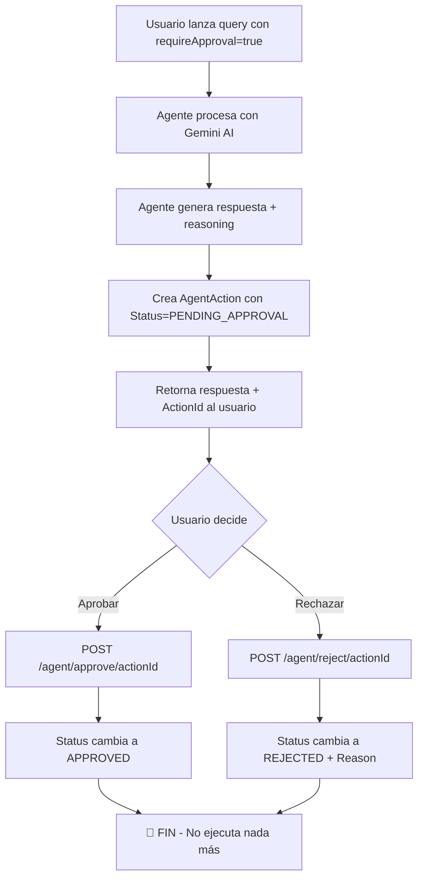
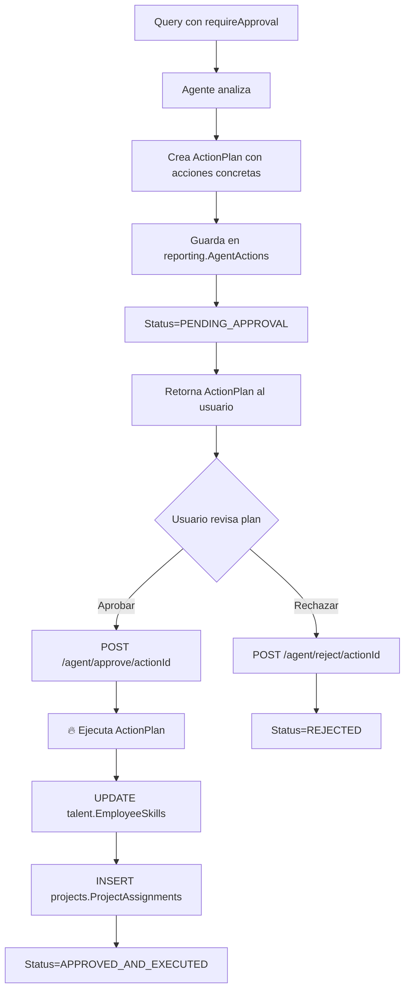

# 🔄 Guía Completa del Flujo HITL (Human-in-the-Loop)

## 📋 Índice
1. [Estado Actual vs. Visión Futura](#estado-actual)
2. [Flujo Funcional HOY](#flujo-funcional-hoy)
3. [Casos de Uso Reales](#casos-de-uso)
4. [Implementación Futura](#implementación-futura)
5. [Ejemplos Prácticos](#ejemplos-prácticos)

---

## ⚠️ Estado Actual vs. Visión Futura {#estado-actual}

### ✅ **Lo que SÍ funciona HOY (v2.0.2)**

| Funcionalidad | Estado | Descripción |
|---------------|--------|-------------|
| **Marcar query como "requiere aprobación"** | ✅ | `requireApproval: true` |
| **Crear acción con estado PENDING_APPROVAL** | ✅ | Se guarda en `reporting.AgentActions` |
| **Retornar ActionId al usuario** | ✅ | ID único para aprobar/rechazar |
| **Aprobar acción (cambiar estado)** | ✅ | `POST /agent/approve/{actionId}` |
| **Rechazar acción (cambiar estado)** | ✅ | `POST /agent/reject/{actionId}` |
| **Auditoría completa** | ✅ | Quien aprobó, cuándo, razón de rechazo |

### ⚠️ **Lo que NO funciona aún (Roadmap)**

| Funcionalidad | Estado | Descripción |
|---------------|--------|-------------|
| **Ejecutar acciones post-aprobación** | ❌ | El agente NO ejecuta cambios en la BD tras aprobar |
| **Rollback de acciones** | ❌ | No se puede deshacer una acción ejecutada |
| **Acciones en batch** | ❌ | Aprobar múltiples acciones simultáneamente |
| **Notificaciones de aprobaciones pendientes** | ❌ | No hay alertas automáticas |

---

## ✅ Flujo Funcional HOY (v2.0.2) {#flujo-funcional-hoy}

### Escenario: Consulta que requiere validación humana



### Código Actual - Aprobar Acción

**AgentService.cs - Líneas 318-333:**
```csharp
public async Task ApproveAgentActionAsync(
    Guid organizationId,
    Guid actionId,
    Guid approvedByUserId,
    CancellationToken cancellationToken = default)
{
    _logger.LogInformation("Aprobando acción {ActionId} por usuario {UserId}",
        actionId, approvedByUserId);

    var action = await _agentRepository.GetActionByIdAsync(actionId, organizationId);
    
    if (action == null)
        throw new InvalidOperationException($"Acción {actionId} no encontrada");

    if (action.Status != "PENDING_APPROVAL")
        throw new InvalidOperationException($"Acción {actionId} no está pendiente de aprobación");

    // ⚠️ SOLO cambia el estado - NO ejecuta ninguna acción
    await _agentRepository.UpdateActionStatusAsync(
        actionId, "APPROVED", approvedByUserId);

    _logger.LogInformation("Acción {ActionId} aprobada exitosamente", actionId);
}
```

**¿Qué hace?** ✅ Actualiza el estado en la BD  
**¿Qué NO hace?** ❌ Ejecutar acciones concretas (UPDATE, INSERT, etc.)

---

## 🎯 Casos de Uso Reales {#casos-de-uso}

### Caso 1: Consulta de Información (FUNCIONA HOY)

**Escenario:** Gerente quiere aprobar respuestas sensibles del agente antes de compartirlas.

```json
// REQUEST
POST /agent/query
{
  "query": "¿Cuáles son los salarios promedio de nuestros desarrolladores Senior?",
  "requireApproval": true
}

// RESPONSE
{
  "response": "El salario promedio es $95,000 USD...",
  "requiresHumanApproval": true,
  "actionId": "a3f7b9c1-...",
  "reasoningSteps": ["Analicé 15 perfiles", "Calculé promedio ponderado"]
}
```

**¿Qué pasa tras aprobar?**
- ✅ El estado cambia a APPROVED en la BD
- ✅ Queda registro de quién aprobó y cuándo
- ⚠️ La respuesta YA fue entregada al usuario (no se bloquea)
- **Uso real:** Auditoría post-facto, no control preventivo

---

### Caso 2: Validación de Skill (FUNCIONA PARCIALMENTE)

**Escenario:** Agente recomienda subir el nivel de skill de un empleado.

```json
// REQUEST
POST /agent/validate-skill
{
  "userId": "123e4567-...",
  "skillId": "789abc-...",
  "claimedLevel": 4,
  "evidenceUrl": "https://github.com/user/projects"
}

// RESPONSE
{
  "isValid": true,
  "confidenceScore": 85,
  "validationReasoning": "El usuario tiene 3 proyectos en producción...",
  "recommendations": ["Actualizar nivel a 4", "Validar certificación"],
  "actionId": "b4c8d2e3-..."  // 👈 NO se usa actualmente
}
```

**¿Qué pasa tras aprobar?**
- ✅ Estado cambia a APPROVED
- ❌ **NO actualiza `talent.EmployeeSkills`** - Debes hacerlo manualmente
- **Uso actual:** Solo auditoría de validaciones

---

### Caso 3: Matching de Candidatos (SOLO INFORMATIVO HOY)

```json
POST /agent/match-candidates
{
  "projectId": "proj-123"
}

// RESPONSE
{
  "candidates": [
    {
      "userId": "user-1",
      "fullName": "Juan Pérez",
      "matchScore": 92,
      "reasoning": "Tiene Java nivel 5 y Spring Boot nivel 4..."
    }
  ],
  "analysisNarrative": "Se encontraron 3 candidatos altamente compatibles",
  "projectName": "Sistema E-commerce"
}
```

**¿Qué pasa tras aprobar matching?**
- ✅ Estado APPROVED registrado
- ❌ **NO crea `ProjectAssignment`** - Debes asignar manualmente
- **Uso actual:** Recomendaciones que requieren acción manual

---

## 🚀 Implementación Futura {#implementación-futura}

### Visión: Flujo HITL con Ejecución Diferida



### Ejemplo de ActionPlan (Futuro)

```json
{
  "actionId": "act-789",
  "actionType": "SKILL_LEVEL_UPDATE",
  "status": "PENDING_APPROVAL",
  "plan": {
    "steps": [
      {
        "stepNumber": 1,
        "action": "UPDATE_EMPLOYEE_SKILL",
        "table": "talent.EmployeeSkills",
        "operation": "UPDATE",
        "data": {
          "userId": "123",
          "skillId": "456",
          "oldLevel": 3,
          "newLevel": 4,
          "validatedByUserId": "agent-system"
        },
        "sql": "UPDATE talent.EmployeeSkills SET Level=4, LastValidatedAt=GETUTCDATE() WHERE UserId='123' AND SkillId='456'"
      }
    ]
  },
  "reasoning": "Usuario demostró competencia avanzada con 3 proyectos..."
}
```

**Tras aprobar:**
```csharp
public async Task ApproveAndExecuteActionAsync(Guid actionId, Guid userId)
{
    var action = await GetActionByIdAsync(actionId);
    var plan = JsonSerializer.Deserialize<ActionPlan>(action.OutputData);
    
    foreach (var step in plan.Steps)
    {
        switch (step.Action)
        {
            case "UPDATE_EMPLOYEE_SKILL":
                await _employeeSkillService.UpdateLevelAsync(
                    step.Data.UserId, 
                    step.Data.SkillId, 
                    step.Data.NewLevel);
                break;
            
            case "CREATE_ASSIGNMENT":
                await _assignmentService.AssignToProjectAsync(
                    step.Data.ProjectId, 
                    step.Data.UserId);
                break;
        }
    }
    
    await UpdateStatusAsync(actionId, "APPROVED_AND_EXECUTED", userId);
}
```

---

## 💡 Ejemplos Prácticos {#ejemplos-prácticos}

### Ejemplo 1: Consulta Sensible con Aprobación

**Paso 1: Lanzar Query**

```powershell
# PowerShell
$token = "tu_jwt_token"
$body = @{
    query = "¿Cuántos desarrolladores tenemos con experiencia en Java y cuál es su nivel promedio?"
    requireApproval = $true
} | ConvertTo-Json

$response = Invoke-RestMethod `
    -Uri "http://localhost:5073/agent/query" `
    -Method POST `
    -Headers @{ "Authorization" = "Bearer $token"; "Content-Type" = "application/json" } `
    -Body $body

Write-Host "Respuesta del agente:"
Write-Host $response.data.response

Write-Host "`nActionId para aprobación:"
Write-Host $response.data.actionId
```

**Resultado:**
```json
{
  "response": "Actualmente tenemos 5 desarrolladores con experiencia en Java:\n- Nivel promedio: 3.8/5\n- 2 con nivel 5 (expertos)\n- 3 con nivel 3-4 (intermedios)",
  "reasoningSteps": [
    "Consulté talent.EmployeeSkills filtrando por Java",
    "Calculé promedio ponderado de niveles",
    "Identifiqué distribución de competencias"
  ],
  "requiresHumanApproval": true,
  "actionId": "f7a3c9b1-5d4e-4f2a-9c8b-1a2b3c4d5e6f"
}
```

**Paso 2: Revisar en la BD**

```sql
SELECT 
    Id,
    ActionType,
    Description,
    Status,  -- 'PENDING_APPROVAL'
    CreatedAt,
    OutputData  -- Contiene la respuesta completa
FROM reporting.AgentActions
WHERE Id = 'f7a3c9b1-5d4e-4f2a-9c8b-1a2b3c4d5e6f';
```

**Paso 3: Aprobar**

```powershell
$approveResponse = Invoke-RestMethod `
    -Uri "http://localhost:5073/agent/approve/f7a3c9b1-5d4e-4f2a-9c8b-1a2b3c4d5e6f" `
    -Method POST `
    -Headers @{ "Authorization" = "Bearer $token" }

Write-Host $approveResponse.message
# Output: "Acción aprobada exitosamente"
```

**Paso 4: Verificar Estado Final**

```sql
SELECT 
    Status,  -- 'APPROVED'
    ApprovedByUserId,  -- Guid del usuario que aprobó
    ApprovedAt  -- Timestamp de aprobación
FROM reporting.AgentActions
WHERE Id = 'f7a3c9b1-5d4e-4f2a-9c8b-1a2b3c4d5e6f';
```

**✅ Qué conseguiste:**
- Registro auditable de que un humano revisó y aprobó la respuesta sensible
- Trazabilidad completa: quién preguntó, qué respondió el agente, quién aprobó

**⚠️ Qué NO conseguiste:**
- La respuesta ya fue entregada al usuario en el Paso 1
- Aprobar no bloquea/desbloquea nada, solo audita

---

### Ejemplo 2: Rechazar Acción

```powershell
$rejectBody = @{
    reason = "La información es inexacta. Hay 7 desarrolladores, no 5."
} | ConvertTo-Json

Invoke-RestMethod `
    -Uri "http://localhost:5073/agent/reject/f7a3c9b1-5d4e-4f2a-9c8b-1a2b3c4d5e6f" `
    -Method POST `
    -Headers @{ "Authorization" = "Bearer $token"; "Content-Type" = "application/json" } `
    -Body $rejectBody
```

**Resultado en BD:**
```sql
SELECT Status, RejectionReason, RejectedByUserId, RejectedAt
FROM reporting.AgentActions
WHERE Id = '...';

-- Status: 'REJECTED'
-- RejectionReason: 'La información es inexacta...'
-- RejectedByUserId: Guid del rechazador
-- RejectedAt: Timestamp
```

**Uso:** Feedback para entrenar/mejorar el agente en el futuro.

---

## 🔮 Roadmap de Mejoras HITL

### Fase 1: Ejecución Diferida (Q2 2026)

- [ ] Implementar `ActionPlan` con steps ejecutables
- [ ] `ApproveAndExecuteActionAsync()` que ejecuta el plan
- [ ] Nuevos estados: `APPROVED_AND_EXECUTED`, `EXECUTION_FAILED`
- [ ] Rollback de acciones ejecutadas

### Fase 2: Notificaciones (Q3 2026)

- [ ] Email/Slack cuando hay acciones pendientes
- [ ] Dashboard de aprobaciones pendientes
- [ ] SLA para aprobaciones (alertas si >24h)

### Fase 3: Aprobaciones Avanzadas (Q4 2026)

- [ ] Aprobación en batch (múltiples acciones)
- [ ] Delegación de aprobaciones por rol
- [ ] Aprobación escalonada (2+ aprobadores)
- [ ] Auto-aprobación basada en confidence score

---

## 📊 Métricas HITL (Disponibles HOY)

```sql
-- Tasa de aprobación/rechazo
SELECT 
    Status,
    COUNT(*) AS Total,
    CAST(COUNT(*) * 100.0 / SUM(COUNT(*)) OVER() AS DECIMAL(5,2)) AS Percentage
FROM reporting.AgentActions
WHERE Status IN ('APPROVED', 'REJECTED')
GROUP BY Status;

-- Tiempo promedio de aprobación
SELECT 
    AVG(DATEDIFF(MINUTE, CreatedAt, ApprovedAt)) AS AvgApprovalMinutes,
    MIN(DATEDIFF(MINUTE, CreatedAt, ApprovedAt)) AS MinApprovalMinutes,
    MAX(DATEDIFF(MINUTE, CreatedAt, ApprovedAt)) AS MaxApprovalMinutes
FROM reporting.AgentActions
WHERE Status = 'APPROVED' AND ApprovedAt IS NOT NULL;

-- Acciones pendientes de aprobación
SELECT 
    Id,
    ActionType,
    Description,
    DATEDIFF(HOUR, CreatedAt, GETUTCDATE()) AS HoursPending
FROM reporting.AgentActions
WHERE Status = 'PENDING_APPROVAL'
ORDER BY CreatedAt ASC;
```

---

## 🎓 Mejores Prácticas

### ✅ DO

1. **Usar `requireApproval` para queries sensibles:**
   - Información salarial
   - Datos personales de empleados
   - Análisis de performance

2. **Revisar acciones pendientes regularmente:**
   ```sql
   -- Dashboard diario
   SELECT COUNT(*) FROM reporting.AgentActions 
   WHERE Status='PENDING_APPROVAL' AND CreatedAt > DATEADD(DAY, -1, GETUTCDATE());
   ```

3. **Documentar razones de rechazo:**
   - Ayuda a mejorar el agente
   - Feedback valioso para fine-tuning

### ❌ DON'T

1. **No esperes que aprobar ejecute acciones automáticamente**
   - Actualmente solo audita, no ejecuta

2. **No uses HITL como control de acceso**
   - No bloquea respuestas, solo registra aprobaciones post-facto

3. **No acumules acciones pendientes indefinidamente**
   - Define SLAs de aprobación (ej: 48 horas máximo)

---

## 📞 Soporte

Si necesitas implementar ejecución diferida de acciones:
1. Revisa [AgentService.cs](Application/Services/AgentService.cs) línea 318
2. Extiende `ApproveAgentActionAsync()` para ejecutar lógica de negocio
3. Considera crear `ActionExecutor` service para separar responsabilidades

**Documentación relacionada:**
- [AGENT_GUIDE.md](AGENT_GUIDE.md) - Arquitectura completa del agente
- [AGENT_TESTING_GUIDE.md](AGENT_TESTING_GUIDE.md) - Scripts de prueba
- [API_EXAMPLES.md](API/API_EXAMPLES.md) - Ejemplos de endpoints

---

**Fecha:** 20 de Enero de 2026  
**Versión:** v2.0.2  
**Estado HITL:** Auditoría funcional ✅ | Ejecución diferida ⚠️ (Roadmap)
